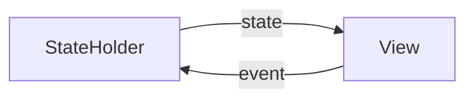

## Work in Progress
Project is under development. Currently only a local version used within a sample KMM app is available as a way to have
some fun with the source code.
## Overview

Make state values defined in KMM shared module easy to observe within Jetpack Compose and SwiftUI code with near zero 
boilerplate.



### Documentation

Documentation is available [here](https://jstarczewski.github.io/kstate/index.html).

### Example
1. Make your class in KMM shared module a `StateHolder` by implementing `StateHolder` interface via interface delegation
pattern with `StateHolder()` function.
2. Use `StateHolder` DSL functions to declare `State` in shared `StateHolder` with `state` delegate.
```Kotlin
class SimpleViewModel : KmmViewModel(), StateHolder by StateHolder() {

    var message by state("Hello World")
        private set

    fun updateMessage() = viewModelScope.launch {
        delay(500)
        message = "Hello kstate"
    }
}
```
### Android
State changes in `@Composable` functions are reflected as shared `State` is available as Compose `MutableState`
```kotlin
@Composable
fun SimpleScreen() {

    val viewModel: SimpleViewModel = viewModel { SimpleViewModel() }

    Box(modifier = Modifier.fillMaxSize()) {
        Greeting(
            modifier = Modifier
                .align(Alignment.Center)
                .clickable { viewModel.updateMessage() },
            text = viewModel.message
        )
    }
}
```
### iOS
Apply `ObservedStateHolder` property wrapper to `SimpleViewModel` to automatically wire state change observation.

**`ObservedStateHolder` is a utility property wrapper that will be generated during [library setup process](#Setup).**
```Swift
struct SimpleView: View {
    
    @ObservedStateHolder var viewModel = SimpleViewModel()
    
	var body: some View {
        Text(viewModel.message)
            .onTapGesture {
                viewModel.updateMessage()
            }
	}
}
```
## Setup
To run and play with the project locally, clone the repository and then publish projects
`kstate-generate` and `kstate-core` to Maven local repository with help of Gradle.

```
./gradlew kstate-generate:publishToMavenLocal kstate-core:publishToMavenLocal
```

### Adding dependencies

To use the `kstate-core` library add it to `dependencies` block inside KMM shared module

```
val commonMain by getting {
    dependencies {
        api("com.jstarczewski:kstate:0.0.2")
    }
}
```

### Generating `.swift` wrappers for iOS

After publication, add `kstate-generate` plugin to your sample project top level `build.gradle.kts` file and configure
generation destination for iOS with
`generateConfig` DSL.

```
plugins {
    id("com.jstarczewski.kstate.generate").version("0.1.1")
}

generationConfig {

    create("ios") {
        outputDir.set("ios/ios/StateHolder")
        sharedModuleName.set("common")
    }
}
```

After successfully applying the plugin generate Swift wrappers. Files should appear in `outputDir` specified in
configuration
block.

```
./gradlew generateSwiftTemplates
```

To link generated files with your project, from XCode `File` menu click `Add files` and create group with sources.
When the files are linked, run the `iOS` app to check whether everything builds. Maybe there are additional changes
needed to be done in the files, but
the vision is that after linking generated sources iOS app should build without anny issues.


**The generation process is a one time operation. After successfully generating everything feel free to add it to source
control and remove `kstate-generate` plugin**
