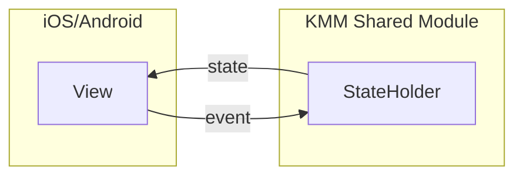
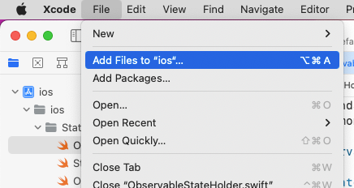
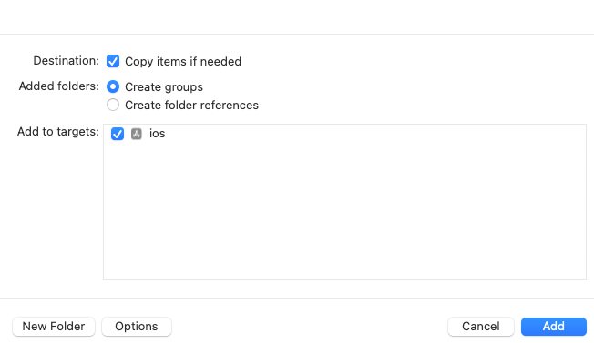

## Work in Progress
Project is under development. Currently only a local version used within a sample KMM app is available as a way to have
some fun with the source code. 

### Local development

To play with the library, create a sample KMM app or use the [example app available on GitHub](https://github.com/jstarczewski/kstate-samples).
The sample probably will not build, because library must be published to `mavenLocal`.
#### Setup
To publish to `mavenLocal` clone the project and execute the following gradle tasks.
```
./gradlew kstate-generate:publishToMavenLocal kstate-core:publishToMavenLocal
```
[Now the sample app available on GitHub](https://github.com/jstarczewski/kstate-samples) should build and work properly. 
## Overview

Make state values defined in KMM shared module easy to observe within Jetpack Compose and SwiftUI code with near zero 
boilerplate by implementation of `StateHolder` interface on class providing data to UI.



### Documentation

Documentation is available [here](https://jstarczewski.github.io/kstate/index.html).

### Example
1. Make your class in KMM shared module a `StateHolder` by implementing `StateHolder` interface via interface delegation
pattern with `StateHolder()` function.
2. Use `StateHolder` DSL functions to declare `Stateful` in shared `StateHolder` with `stateful` delegate.
```Kotlin
class SimpleViewModel : KmmViewModel(), StateHolder by StateHolder() {

    var message by stateful("Hello World")
        private set

    fun updateMessage() = viewModelScope.launch {
        delay(500)
        message = "Hello k-state"
    }
}
```
### Android
State changes in `@Composable` functions are reflected because shared `State` on Android platform is exposed as Compose `MutableState`
```kotlin
@Composable
fun SimpleScreen() {

    val viewModel: SimpleViewModel = viewModel { SimpleViewModel() }

    Box(modifier = Modifier.fillMaxSize()) {
        Greeting(
            modifier = Modifier
                .align(Alignment.Center)
                .clickable { viewModel.updateMessage() },
            text = viewModel.message
        )
    }
}
```
### iOS
Apply `ObservedStateHolder` property wrapper to `SimpleViewModel` to automatically wire state change observation.

**`ObservedStateHolder` is a utility property wrapper that will be generated during [library setup process](#Setup).**
```Swift
struct SimpleView: View {
    
    @ObservedStateHolder var viewModel = SimpleViewModel()
    
	var body: some View {
        Text(viewModel.message)
            .onTapGesture {
                viewModel.updateMessage()
            }
	}
}
```

### Adding dependencies

To use the `kstate-core` library add it to `dependencies` block inside KMM shared module

```
val commonMain by getting {
    dependencies {
        api("com.jstarczewski.kstate:kstate-core:0.0.3")
    }
}
```

### Generating `.swift` wrappers for iOS

After publication, add `kstate-generate` plugin to your sample project top level `build.gradle.kts` file and configure
generation destination for iOS with
`swiftTemplates` DSL.

```
plugins {
    id("com.jstarczewski.kstate.generate").version("0.0.3")
}

swiftTemplates {

    outputDir = "../ios/ios/StateHolder"
    sharedModuleName = "common"
}
```

Depending on whether the for sake of the project architecture the `kstate-core` library is 
[exported or not](https://kotlinlang.org/docs/multiplatform-build-native-binaries.html#export-dependencies-to-binaries) 
additional templates setup may be needed.

The default behaviour is that the `kstate-core` is not exported and no further configuration is needed, but for 
exported `kstate-core` where the export example is contained withing the following snippet of `build.gradle.kts` file.

```
kotlin {
    android()

    listOf(
        iosX64(),
        iosArm64(),
        iosSimulatorArm64()
    ).forEach {
        it.binaries.framework {
            baseName = "common"
            export(project(":feature:saveable"))
            export(project(":feature:obtainable"))
            export("com.jstarczewski.kstate:kstate-core:0.0.3")
        }
    }

    sourceSets {
        val commonTest by getting
        val commonMain by getting {
            dependencies {
                implementation(kotlin("test"))
                api(project(":feature:saveable"))
                api(project(":feature:obtainable"))
                api("com.jstarczewski.kstate:kstate-core:0.0.3")
            }
        }
    // Rest of build.gradle.kts file....    
```

Templates need extra configuration to work. Add the following `coreLibraryExported` flag set to `true` to `swiftTempaltes` config.

```
plugins {
    id("com.jstarczewski.kstate.generate").version("0.0.3")
}

swiftTemplates {

    outputDir = "../ios/ios/StateHolder"
    sharedModuleName = "common"
    // On default it is set to false
    coreLibraryExported = true
}
```

After successfully applying the plugin generate Swift wrappers. Files should appear in `outputDir` specified in
configuration
block.

```
./gradlew generateSwiftTemplates
```

To link generated files with your project, from XCode `File` menu click `Add files` and create group with sources.
When the files are linked, run the `iOS` app to check whether everything builds. Maybe there are additional changes
needed to be done in the files, but
the vision is that after linking generated sources iOS app should build without anny issues.





**The generation process is a one time operation. After successfully generating everything feel free to add it to source
control and remove `kstate-generate` plugin**
