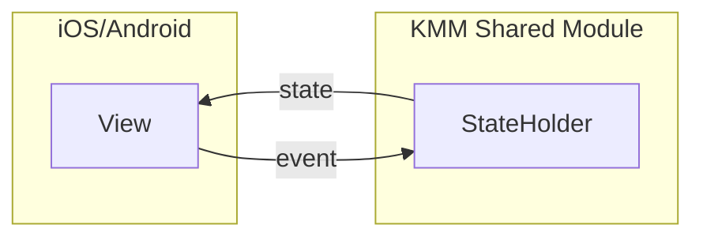

# Overview

Make state defined in KMM shared module easy to observe within Jetpack Compose and SwiftUI code with near zero
boilerplate by implementation of `StateHolder` interface on class providing state to UI.



Define a `ViewModel`, `Store` or whatever implementing a `StateHolder` interface inside your shared module. Use it in
the platform. Follow the [example walkthrough](#example-walkthrough) for more details.

```Kotlin
class SimpleViewModel : KmmViewModel(), StateHolder by StateHolder() {

    var message by stateful("Hello World")
        private set

    fun updateMessage() = viewModelScope.launch {
        delay(500)
        message = "Hello k-state"
    }
}
```

## Quick setup

Add `kstate-core` dependency to the `commonMain` source set.

```Kotlin
val commonMain by getting {
    dependencies {
        implementation("com.jstarczewski.kstate:kstate-core:0.0.3")
    }
}
```

Depending on the architecture consider [exporting the library](#export-kstate-core-library).

Add `kstate.generate` gradle plugin to proper gradle module to generate Swift wrappers.

```Kotlin
plugins {
    id("com.jstarczewski.kstate.generate").version("0.0.3")
}
```

Configure wrappers by `kstate.generate` DSL syntax.

```Kotlin
swiftTemplates {

    outputDir = "../ios/ios/StateHolder"
    sharedModuleName = "common"
    coreLibraryExported = false
}
```

Generate templates for iOS app by executing following gradle task.

```
./gradlew generateSwiftTemplates
```

### [Link generated files](#link-generated-files) and add them to VCS.

After generation the plugin is no longer needed and can be safely removed from the project configuration.

### Documentation

Documentation is available [here](https://jstarczewski.github.io/kstate/index.html).

### Samples

Samples are available as an [example app on GitHub](https://github.com/jstarczewski/kstate-samples).

### Example walkthrough

1. Make your class in KMM shared module a `StateHolder` by implementing `StateHolder` interface via interface delegation
   pattern with `StateHolder()` function.
2. Use `StateHolder` DSL functions to declare `Stateful` in shared `StateHolder` with `stateful` delegate.

```Kotlin
class SimpleViewModel : KmmViewModel(), StateHolder by StateHolder() {

    var message by stateful("Hello World")
        private set

    fun updateMessage() = viewModelScope.launch {
        delay(500)
        message = "Hello k-state"
    }
}
```

### Android

State changes in `@Composable` functions are reflected because shared `State` on Android platform is exposed as
Compose `MutableState`

```kotlin
@Composable
fun SimpleScreen() {

    val viewModel: SimpleViewModel = viewModel { SimpleViewModel() }

    Box(modifier = Modifier.fillMaxSize()) {
        Greeting(
            modifier = Modifier
                .align(Alignment.Center)
                .clickable { viewModel.updateMessage() },
            text = viewModel.message
        )
    }
}
```

### iOS

Apply `ObservedStateHolder` property wrapper to `SimpleViewModel` to automatically wire state change observation.

**`ObservedStateHolder` is a utility property wrapper that will be generated
during [library setup process](#Quick setup).**

```Swift
struct SimpleView: View {
    
    @ObservedStateHolder var viewModel = SimpleViewModel()
    
	var body: some View {
        Text(viewModel.message)
            .onTapGesture {
                viewModel.updateMessage()
            }
	}
}
```

### Export `kstate-core` library

Depending on whether the for sake of the project architecture the `kstate-core` library should be
[exported or not](https://kotlinlang.org/docs/multiplatform-build-native-binaries.html#export-dependencies-to-binaries)
additional templates setup may be needed.

The default behaviour is that the `kstate-core` is not exported and no further configuration is needed, but for
exported `kstate-core` where the export example is contained withing the following snippet of `build.gradle.kts` file.

```
kotlin {
    android()

    listOf(
        iosX64(),
        iosArm64(),
        iosSimulatorArm64()
    ).forEach {
        it.binaries.framework {
            baseName = "common"
            export(project(":feature:saveable"))
            export(project(":feature:obtainable"))
            export("com.jstarczewski.kstate:kstate-core:0.0.3")
        }
    }

    sourceSets {
        val commonTest by getting
        val commonMain by getting {
            dependencies {
                implementation(kotlin("test"))
                api(project(":feature:saveable"))
                api(project(":feature:obtainable"))
                api("com.jstarczewski.kstate:kstate-core:0.0.3")
            }
        }
    // Rest of build.gradle.kts file....    
```

Templates need extra configuration to work. Add the following `coreLibraryExported` flag set to `true`
to `swiftTempaltes` config.

```
plugins {
    id("com.jstarczewski.kstate.generate").version("0.0.3")
}

swiftTemplates {

    outputDir = "../ios/ios/StateHolder"
    sharedModuleName = "common"
    // On default it is set to false
    coreLibraryExported = true
}
```

After successfully applying the plugin configuration, generate Swift wrappers. Files should appear in `outputDir`
specified in
configuration
block.

```
./gradlew generateSwiftTemplates
```

### Link generated files

To link generated files with your project, from XCode `File` menu click `Add files` and create group with sources.
When the files are linked, run the `iOS` app to check whether everything builds. Maybe there are additional changes
needed to be done in the files, but
the vision is that after linking generated sources iOS app should build without anny issues.


**The generation process is a one time operation. After successfully generating everything feel free to add it to source
control and remove `kstate-generate` plugin**
